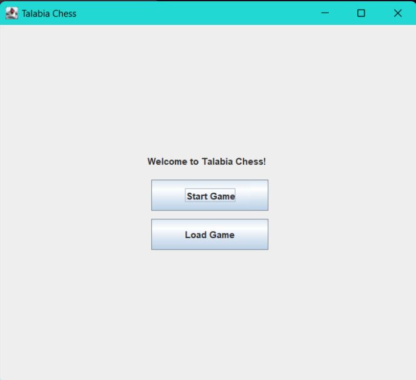
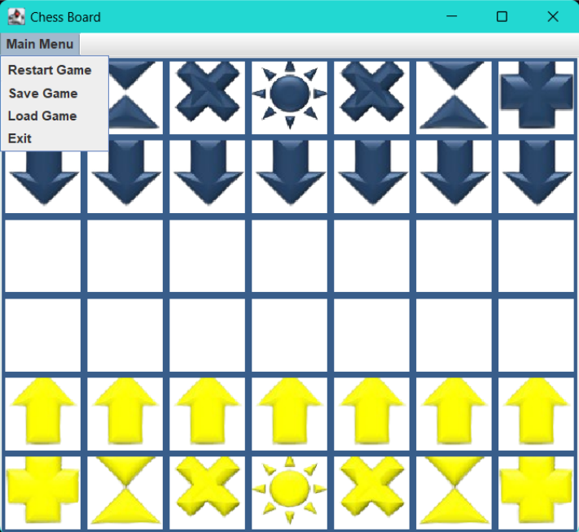
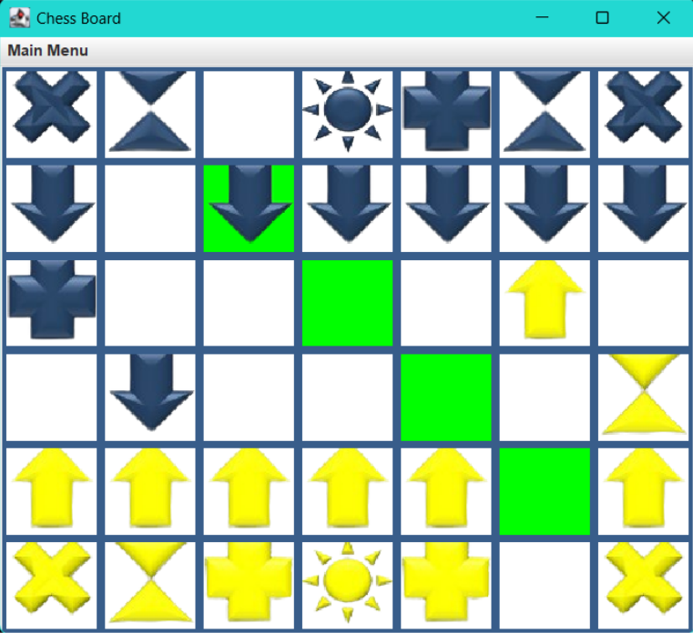
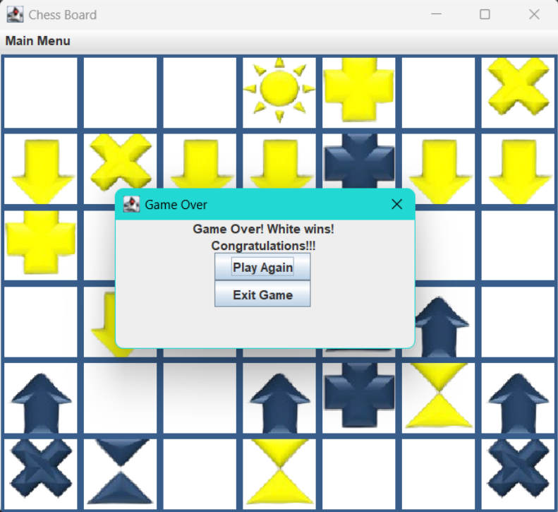

# Talabia Chess ♟️

A unique Java Swing-based chess variant featuring dynamic board rotation and shape-shifting pieces. Developed as part of the Object-Oriented Analysis and Design (OOAD) course assignment.

---

## 🌐 Overview

**Talabia Chess** reimagines the classic chess game with new strategic layers, implemented using **Java Swing**. Unlike traditional chess, this game introduces a dynamic board that rotates 180 degrees every turn, offering fresh perspectives, and pieces that switch positions after every round.

The project was built to demonstrate advanced **Object-Oriented Analysis and Design (OOAD)** principles, utilizing the **MVC (Model-View-Controller)** pattern to separate game logic, user interface, and data management.

**Contributors:**
- **Wong Ju Wei** – UI/UX Design, Board Layout & Core Mechanics
- **Loh Zheng Bin** – Game Logic, Rules & Win Conditions
- **Lim Ye Xin** – Board Mechanics, Move Validation & Save/Load System
- **Yap Rui Ern** – Game States, Save/Load System & Start Screen

---

## 📁 Repository Structure

```
Degree-Y2-OOAD-Talabia-Chess/
├── Code/
│   ├── Image/              # Assets for chess piece icons
│   ├── Control.java        # Controller: Game loop and logic updates
│   ├── View.java           # View: GUI implementation (Swing)
│   ├── Piece.java          # Model: Abstract base class for pieces
│   ├── Player.java         # Model: Player state management
│   └── [PieceSubclasses]   # Concrete pieces (Sun, Plus, Time, etc.)
├── Screenshots/            # Gameplay images
├── TC3L teams - Group 25_OOAD Report.pdf  # Comprehensive project documentation
└── README.md
```

---

## ✨ Features

- **🔄 Dynamic Board Rotation**: The board rotates 180° after every turn, ensuring each player always views the board from the bottom-up perspective.
- **🔀 Position Switching**: After every full round (both players move), the **Time** ⏲️ and **Plus** ➕ pieces switch positions.
- **💾 Save & Load System**: Manually save your progress to a text file (`1.txt`) and resume later.
- **♟️ Custom Pieces**: Unique piece set with distinct movement patterns (Sun, Plus, Time, HourGlass, Point).

---

## 🧠 Key Concepts Demonstrated

### 1. MVC Architecture
The application strictly follows the **Model-View-Controller** pattern:

```
┌─────────────┐          Updates          ┌──────────────┐
│    View     │ ◄─────────────────────────│   Control    │
│  (GUI/View) │                           │ (Game Logic) │
└──────┬──────┘                           └──────┬───────┘
       │                                         │
       │ User Input                              │ Manipulates
       ▼                                         ▼
┌─────────────┐                           ┌──────────────┐
│ Controller  │──────────────────────────►│    Model     │
│ (Listeners) │                           │(Pieces/Board)│
└─────────────┘                           └──────────────┘
```

- **Model**: `Piece`, `Player`, and `Position` classes encapsulate game state and data.
- **View**: `View.java` manages the Swing GUI, drawing the board and handling user clicks.
- **Controller**: `Control.java` mediates between Model and View, executing game logic and rule enforcement.

### 2. Object-Oriented Principles
- **Polymorphism**: The abstract `Piece` class defines common behaviors (move validation), which are overridden by concrete classes like `Sun` and `Time`.
- **Encapsulation**: Game state is protected within objects, accessed only through defined methods.
- **Inheritance**: All game pieces inherit properties from the base `Piece` class.

---

## 🚀 Getting Started

### Prerequisites
- **Java Development Kit (JDK) 8** or higher.

### Installation & Run

1.  **Clone the repository**
    ```bash
    git clone https://github.com/juwei-w/Degree-Y2-OOAD-Talabia-Chess.git
    cd Degree-Y2-OOAD-Talabia-Chess/Code
    ```

2.  **Compile the source code**
    ```bash
    javac *.java
    ```

3.  **Run the game**
    ```bash
    java View
    ```

---

## 🎮 Game Rules

### Piece Movements
| Piece | Symbol | Movement |
|-------|--------|----------|
| **Sun** (King) | ☀️ | Moves 1 step in any direction. |
| **Point** (Pawn) | 🔹 | Moves 1 or 2 steps forward. Captures pieces directly in front. |
| **HourGlass** (Knight) | ⏳ | Moves in a 3x2 'L' shape. |
| **Time** (Bishop-like) | ⏲️ | Moves diagonally (Switches positions with Plus). |
| **Plus** (Rook-like) | ➕ | Moves orthogonally (Switches positions with Time). |

### Special Mechanics
1.  **Rotation**: The board flips 180° after every move.
2.  **Position Switching**: At the end of a round (2 turns), **Time** and **Plus** switch positions.

---

## 📸 Screenshots

**Start Screen**


**Main Menu**


**Gameplay Action**


**End Game**


---

## 🔗 Resources

- **Repository:** [github.com/juwei-w/Degree-Y2-OOAD-Talabia-Chess](https://github.com/juwei-w/Degree-Y2-OOAD-Talabia-Chess)
- **Issues:** [Report a bug](https://github.com/juwei-w/Degree-Y2-OOAD-Talabia-Chess/issues)

---

*Object-Oriented Analysis and Design • Degree Year 2 Sem 1 • Nov 2023 - March 2024*
